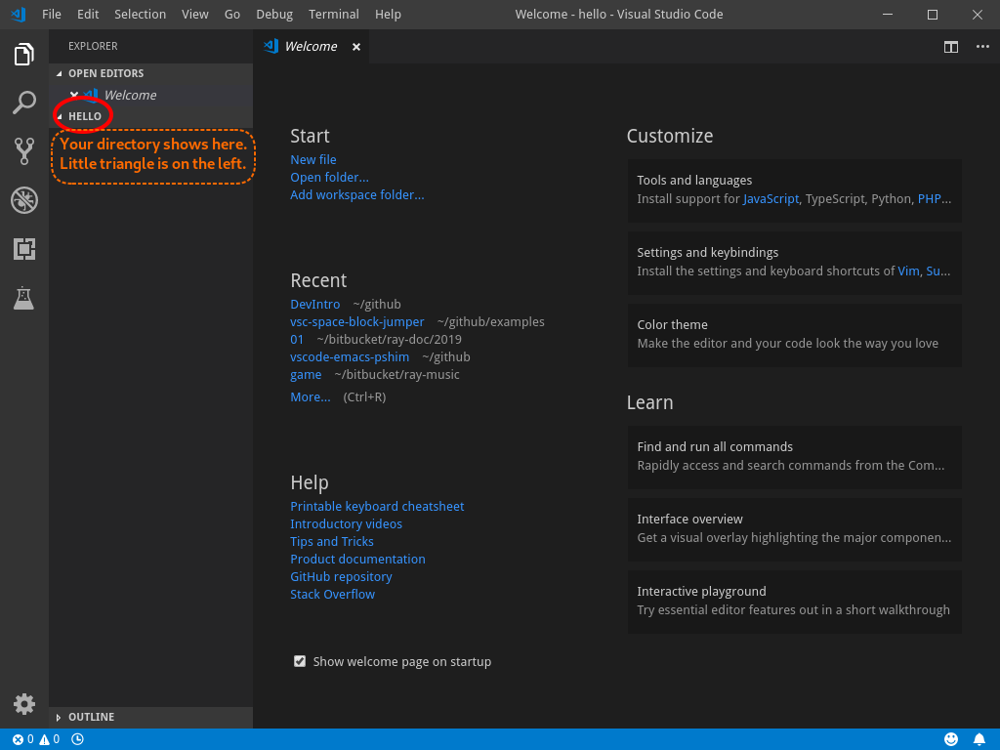

# Basic Visual Studio Code

<!-- vscode-markdown-toc -->
* 1. [Project Directory with "Hello, World" example.](#ProjectDirectorywithHelloWorldexample.)
* 2. [Call "Visual Studio Code", by magic command `code .`](#CallVisualStudioCodebymagiccommandcode.)
	* 2.1. [Creating `main.py`, the executable file for your project.](#Creatingmain.pytheexecutablefileforyourproject.)
	* 2.2. [The first code for `main.py`](#Thefirstcodeformain.py)
	* 2.3. [And, let's finish the code.](#Andletsfinishthecode.)
	* 2.4. [RUN!](#RUN)

<!-- vscode-markdown-toc-config
	numbering=true
	autoSave=true
	/vscode-markdown-toc-config -->
<!-- /vscode-markdown-toc -->

We have learned how to maneuver directories.  After the login, the terminal will land on HOME directory (/home/jake/).  From there, we "cd" and "mkdir" to move around, and create directories.  Now, we will discuss how to create a python program.

##  1. <a name='ProjectDirectorywithHelloWorldexample.'></a>Project Directory with "Hello, World" example.

- At this point, we will create all projects under `/home/jake/prj`
- All project starts with project name as directory name.  In our case, our project name is "hello".  So, our starting commands will look like this:
```
$ cd

$ cd prj

$ ls -l
total 8
drwxrwxr-x. 7 rchung rchung 4096 Dec 16 00:59 ray-ext-vscode
drwxrwxr-x. 7 rchung rchung 4096 Dec 15 14:07 venv-node.js

$ mkdir hello

$ cd hello

```

##  2. <a name='CallVisualStudioCodebymagiccommandcode.'></a>Call "Visual Studio Code", by magic command `code .`

Wait, `code` is the executable file name for "Visual Studio Code."  But, what is '.' thing?
We will cover this later.  At this moment, just accept that we call "code ." to open a project.

```
$ pwd
/home/rchung/prj/hello

$ code .
```



The "Little Triangle" button is called "expand button".  It will expand/fold the section.

- _Try click little triangle(expand button) once._
- See some animation is happening.
- _click little triangle(expand button) again._

###  2.1. <a name='Creatingmain.pytheexecutablefileforyourproject.'></a>Creating `main.py`, the executable file for your project.

At this point, you just created directory "hello", and no file is in the directory.  We will create the first file.
Usually, your first file is named "main.py"  This is a convention, but a good practice.


###  2.2. <a name='Thefirstcodeformain.py'></a>The first code for `main.py`

`main.py` will almost always have starting with following two lines.

```
import os
import sys
```

And, then, your code will live in a special block look like this.
You may ask, "What the heck is this?".  Don't worry.  We will talk about this later.  Just accept it for now.  Besides, VSCode will help you making this code snippet.

```
if __name__ == '__main__':
    <your code>

```


###  2.3. <a name='Andletsfinishthecode.'></a>And, let's finish the code.

Your entire program will look like this:
```
import os
import sys

if __name__ == '__main__':
    print("Hello, World.")
```


###  2.4. <a name='RUN'></a>RUN!

After the code is ready, we are running this code pressing 'F5' button.

